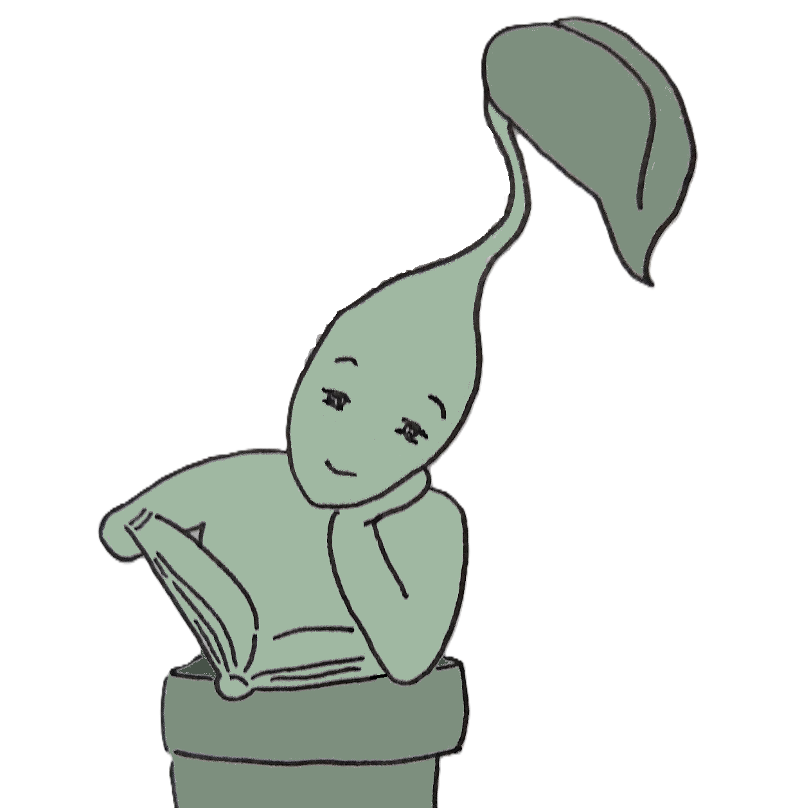

# My Plant Journal

**My Plant Journal** is a personal plant care tracking app built to demonstrate thoughtful data modelling, decision‑focused UX, and an architecture designed to support future AI‑assisted insights.

The app helps answer a simple daily question: *what needs attention today, and why?*

It does this by combining structured care logging, seasonal context, and clear status signals, alongside an optional AI‑generated plant journal entry that turns the plant's profile and recent care history into a readable, human‑friendly narrative.
This is a deliberately non‑automated project: the emphasis is on explainable logic, trustworthy data, and AI used as an interpretive layer rather than a decision‑maker.

---

## What the app does

- Track plant care events such as watering, feeding, and ad‑hoc notes  
- Apply seasonal context to care intervals and status calculations  
- Surface clear, aggregated signals (e.g. plants due vs total)
- Support multiple plants of the same species in different locations
- Generate a short plant journal entry per plant, grounded entirely in logged care history and profiles
- Provide a calm, readable UI optimised for daily decision‑making  

---

## Design principles

- **Decision‑first**: the app focuses on helping users decide *what to do next*, not just logging data  
- **Explainable logic**: all status signals are derived from transparent rules, not black‑box automation  
- **Grounded AI, not generative guesswork**: AI outputs are constrained to known data (plant profile, seasonal care intent, and care logs). The app does not invent observations or diagnoses
- **Human‑in‑the‑loop**: care decisions remain user‑controlled, AI is used to summarise and contextualise, not to issue commands 

---

### A note on tone
- The app includes a small, hand‑drawn plant mascot used as a narrative voice for the optional AI‑generated journal entries
- This is a deliberate design choice, keeping the AI layer readable and human‑centred, without obscuring the underlying data or decision logic

---

## Data model & AI layer

The data model deliberately separates **context**, **intent**, and **observed behaviour**.

- **Species** store shared, stable context (e.g. native climate, care tendencies)
- **Plants** represent individual instances of a species, each with its own environment
- **Care profiles** capture seasonal care intent (watering / feeding intervals)
- **Care logs** record what actually happened, as an append‑only history

This structure allows the app to handle multiple plants of the same species behaving differently in different locations, and to reason about how real‑world care aligns (or diverges) from expectations.

---
## AI plant journal entries

For each plant, the app can generate a short plant journal entry:

Written in the first person, from the plant’s perspective
Based entirely on the structured data above (no external knowledge or speculation)
Regenerated only when underlying data changes (using stable cache keys)
Presented alongside the raw facts used to generate it, for transparency

The AI layer is intentionally narrow in scope: it acts as a **readable narrative lens** over existing data, not as an automated care system.

---
## Tech stack

- Python  
- Streamlit (UI)  
- SQLite (local persistence)
- Google Gemini API (text generation, tightly contrained and cashed)  

---

## Why this project exists

This project began as a personal hobby and learning exercise, combining a love for indoor plants with data analysis and a desire to explore something new. It later evolved into a **portfolio piece** to demonstrate:

- Structured data modelling and schema design  
- Translating messy real‑world behaviour into clear metrics  
- Designing AI features that are constrained, auditable, and user‑trust‑preserving
- Balancing usability, explainability, and future extensibility

It is intentionally small in scope but opinionated in design.

---

## Status

Active personal project. Core data model and UI are stable; current work focuses on insight quality and presentation, not feature sprawl.
